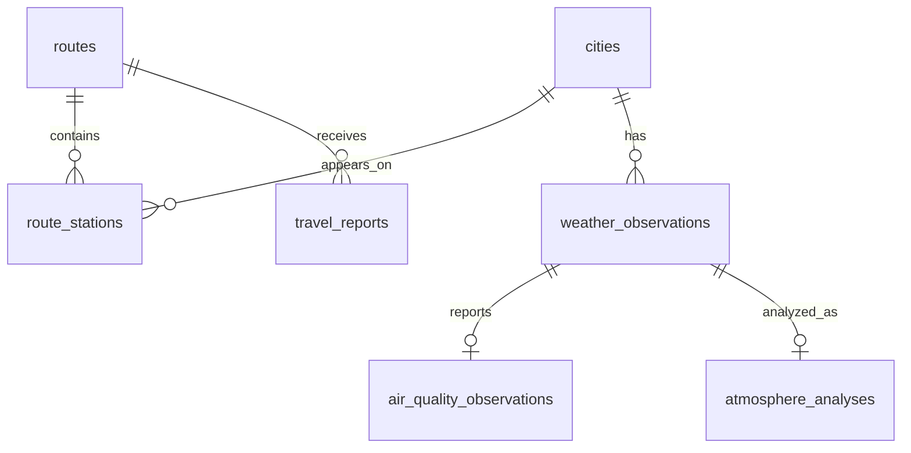

# CtoN 数据库设计文档

> 本文描述当前数据库职责和数据流。生产运行状态与待完成的恢复演练记录在 [开发进展与项目状态](Development_Status.md)，结构变更流程见 [生产部署手册](Production_Deployment.md)。

数据库：Neon PostgreSQL
访问方式：psycopg 直接 SQL，不使用 ORM

## 1. 设计目标

数据库保存固定线路、城市和站点配置，以及天气、空气质量、大气稳定度和路线建议。设计重点是：

- 数据流直接、可追踪，不在 ORM 生命周期中隐藏写入；
- 同一城市同一天只有一条天气快照；
- 同一线路同一天只有一条路线建议；
- Serverless 并发实例通过数据库租约互斥第三方更新；
- 冷启动只校验配置，不建表、不改结构、不写种子。

## 2. 连接与初始化

生产运行时的 `DATABASE_URL` 必须使用 Neon 池化地址。建表和固定种子使用非池化 `DATABASE_MIGRATION_URL`：

```bash
DATABASE_MIGRATION_URL='postgresql://direct...' python -m backend.database
```

初始化命令按顺序执行 `CREATE TABLE IF NOT EXISTS`，然后 UPSERT 固定线路、城市和站点。它可以重复执行，但不会写入或覆盖 `weather_observations`、`air_quality_observations`、`atmosphere_analyses` 或 `travel_reports`。

测试统一使用 `TEST_DATABASE_URL`。任何清理发生前，代码都会解析目标数据库名并要求其以 `_test` 结尾。

## 3. 关系



`scheduled_update_runs` 按业务日期和时段记录 Cron 结果；旧 `daily_update_runs` 仅保留已有生产记录和过渡兼容。`operation_leases` 是全局更新互斥状态，不属于具体路线。

## 4. 表

### `routes`

固定线路。`id` 为 identity 主键，`code` 唯一，`geometry_json` 保存 GeoJSON 坐标数组，`is_active` 使用 PostgreSQL `BOOLEAN`。

### `cities`

天气查询城市。`name` 和和风天气 `city_code` 分别唯一；经纬度用于天气和太阳位置计算。

### `route_stations`

线路站点。外键连接路线和城市，`(route_id, city_id)`、`(route_id, station_order)` 唯一。站点经纬度与城市天气经纬度分开保存。

### `weather_observations`

每日天气快照。`(city_id, observation_date)` 唯一，包含温度、体感温度、天气代码、湿度、风、能见度、云量和来源。

### `air_quality_observations`

每条天气快照至多一条空气质量记录，`weather_observation_id` 唯一。天气删除时级联删除空气质量。

### `atmosphere_analyses`

每条天气快照至多一条帕斯奎尔稳定度估算，保存输入、分类、解释、置信度和计算版本。输入不足时不保留分析记录。

### `travel_reports`

按线路和业务日期保存 DeepSeek 建议。`(route_id, travel_date)` 唯一；只有模型输出通过校验后才 UPSERT，因此失败不会覆盖最近的有效建议。

新生成记录的 `source_snapshot_json` 是对象，保存 `run_slot` 和实际用于生成建议的规范化城市输入；每项以 `source_type` 区分 `forecast` 与 `observation`，实况包含真实观测时间。旧记录使用的天气观测 ID 数组无需迁移，公开读取接口也不返回该内部字段。

### `scheduled_update_runs`

`(run_date, run_slot)` 为复合主键，`run_slot` 只允许 `morning`、`afternoon`、`evening`，保证同一天三个时段可分别执行且同一时段只领取一次。`trigger` 固定为 `cron`；状态为 `running`、`succeeded`、`partial`、`failed` 或 `skipped`。同时记录天气、上午预报和建议的成功/失败计数及脱敏错误摘要。

### `daily_update_runs`

旧单次每日任务的历史运行表。新时段任务不再写入该表，当前保留它是为了向后兼容，既有记录无需迁移。

### `operation_leases`

| 字段 | 说明 |
|---|---|
| `lease_name` | 主键；当前统一使用 `external-data-update` |
| `owner_token` | 每次调用生成的随机所有者标识 |
| `expires_at` | PostgreSQL 服务器时间下的租约过期点 |

天气刷新、单线路建议生成和 Cron 共用这一把租约。领取使用单条 `INSERT ... ON CONFLICT DO UPDATE ... WHERE expires_at <= NOW() RETURNING`，因此多个 Vercel 实例中只有一个成功。正常结束按所有者删除；函数异常结束后由过期时间恢复可用性。

## 5. 事务边界

1. Cron 先取得操作租约，再按日期和时段插入 `scheduled_update_runs`；复合主键已存在则返回 `skipped`。
2. 天气批次在独立事务中刷新。单个城市的供应商错误会记录在结果中，并继续其他城市。
3. 上午任务逐城读取当日昼夜预报；单城预报失败时，建议输入回退到该城当天最新实况。下午和夜间不请求预报。
4. 天气事务提交后，路线建议按线路分别提交。某条线路失败不回滚已保存天气或其他线路建议，失败也不会覆盖旧建议。
5. 最后更新 `scheduled_update_runs` 的状态、计数和错误摘要，并释放租约。

管理员 POST 使用相同租约；占用时返回业务码 `40901`。数据库上下文管理器在成功时提交，在异常时回滚并重新抛出原错误。

## 6. 索引与约束

- `route_stations(route_id, station_order)`：线路详情和剖面排序；
- `weather_observations(city_id, observation_date DESC)`：城市最近天气；
- `travel_reports(route_id, travel_date DESC)`：最近有效建议；
- 外键删除规则明确使用 `CASCADE` 或 `RESTRICT`；
- 所有参数通过 psycopg `%s` 占位符传入，不拼接用户输入。

实际建表语句以 `backend/database.py` 的 `SCHEMA_STATEMENTS` 为准。当前没有需要迁移的线上 SQLite 数据，因此不提供 SQLite 导入工具。

## 7. 恢复

生产恢复使用 Neon 当前套餐提供的时间点恢复或分支能力。恢复时先创建独立分支并验证，再切换生产连接；不再使用本地 SQLite 快照或阿里云 OSS，也不承诺固定 90 天留存。操作步骤见 `docs/Production_Deployment.md`。
