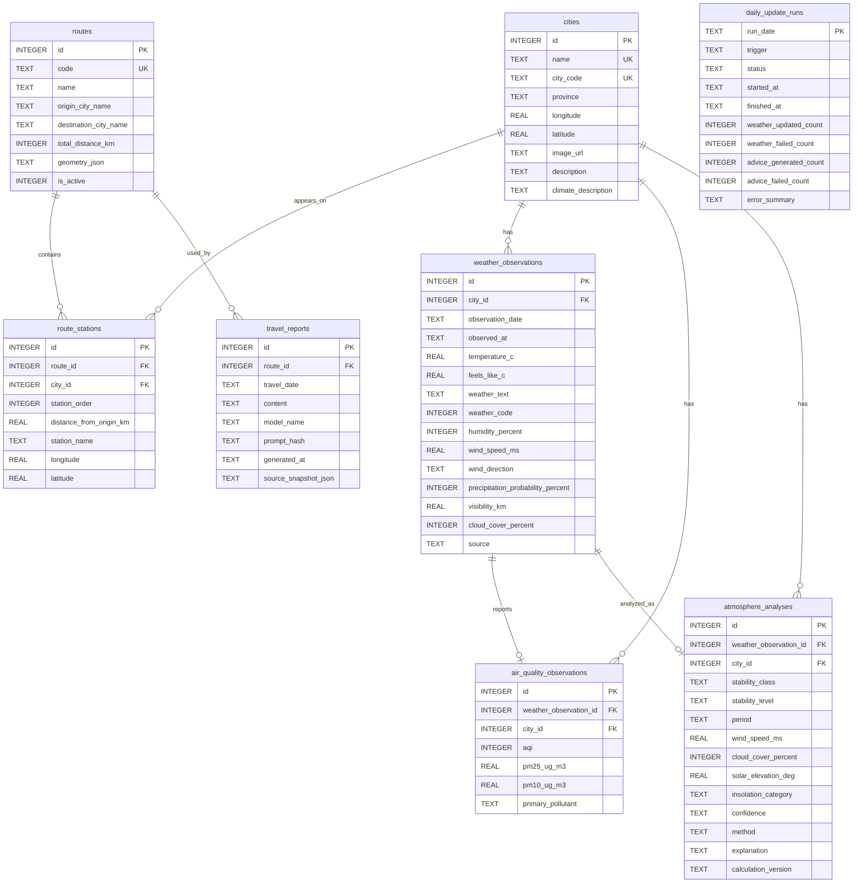

# CtoN 数据库设计文档

版本：1.0  
项目：CtoN（Chongqing to Nanjing）  
数据库：SQLite 3  
ORM：SQLAlchemy

## 1. 设计目标

数据库服务于“重庆至南京高铁沿线气象可视化系统”，支持：

- 展示线路、城市节点及高铁距离；
- 查询某个城市某一天的天气、空气质量和气象分析；
- 生成沿线温度、湿度、AQI、风速剖面；
- 保存按天气生成的两句诗；
- 根据出行日期保存一份旅行气象报告。

设计原则：静态地理信息与动态气象快照分离；同一城市同一日期只保留一条业务快照；动态数据只保留最近半个月（15 个自然日）；所有外部数据均保存来源和更新时间，便于排错和重新生成。

## 2. 数据库约定

### 2.1 SQLite 设置

应用启动时执行：

```sql
PRAGMA foreign_keys = ON;
PRAGMA journal_mode = WAL;
PRAGMA busy_timeout = 5000;
```

SQLite 没有独立的 `BOOLEAN`、`DATE`、`DATETIME` 类型，因此使用以下约定：

| 逻辑类型 | SQLite 类型 | 约定 |
|---|---|---|
| 主键 | `INTEGER` | `INTEGER PRIMARY KEY`，由 SQLite 生成；不使用 UUID |
| 短文本 | `TEXT` | UTF-8，名称、状态、描述等 |
| 整数 | `INTEGER` | 计数、排序、分钟、百分比等 |
| 小数 | `REAL` | 温度、经纬度、气压、距离等 |
| 布尔值 | `INTEGER` | 仅允许 `0` 或 `1` |
| 日期 | `TEXT` | ISO 8601 日期：`YYYY-MM-DD` |
| 时间 | `TEXT` | UTC ISO 8601：`YYYY-MM-DDTHH:MM:SSZ` |
| JSON | `TEXT` | 合法 JSON 字符串；仅用于外部原始响应或结构化报告 |

所有距离单位为 km，温度为 °C，湿度、云量和降水概率为 %，风速为 m/s，能见度为 km，太阳高度角为度，污染物浓度为 µg/m³。

## 3. ER 设计



关系说明：

1. `routes` 与 `cities` 是多对多关系，由 `route_stations` 保存线路顺序和距起点距离；这样同一城市可以出现在多条线路中。
2. `weather_observations` 是城市天气快照主表，`air_quality_observations` 和 `atmosphere_analyses` 为其一对一扩展记录。
3. `travel_reports` 保存已生成的全线路建议，AI 失败时保留最近一次成功结果。

## 4. 表结构

### 4.1 `routes`：高铁线路

| 字段 | 类型 | 约束 | 说明 |
|---|---|---|---|
| `id` | `INTEGER` | PK | 线路 ID |
| `code` | `TEXT` | NOT NULL, UNIQUE | 稳定业务编码，如 `CTN` |
| `name` | `TEXT` | NOT NULL | 线路名称 |
| `origin_city_name` | `TEXT` | NOT NULL | 起点城市显示名 |
| `destination_city_name` | `TEXT` | NOT NULL | 终点城市显示名 |
| `total_distance_km` | `INTEGER` | NOT NULL, CHECK >= 0 | 线路总距离 |
| `geometry_json` | `TEXT` | NULL | 高德地图路线坐标 JSON；不参与业务查询 |
| `is_active` | `INTEGER` | NOT NULL, DEFAULT 1, CHECK IN (0,1) | 是否在前端展示 |
| `created_at` | `TEXT` | NOT NULL | 创建时间 |
| `updated_at` | `TEXT` | NOT NULL | 修改时间 |

### 4.2 `cities`：城市静态信息

| 字段 | 类型 | 约束 | 说明 |
|---|---|---|---|
| `id` | `INTEGER` | PK | 城市 ID |
| `name` | `TEXT` | NOT NULL, UNIQUE | 城市名称 |
| `city_code` | `TEXT` | NOT NULL, UNIQUE | 天气 API 城市编码 |
| `province` | `TEXT` | NOT NULL | 所属省级行政区 |
| `longitude` | `REAL` | NOT NULL, CHECK BETWEEN -180 AND 180 | 经度 |
| `latitude` | `REAL` | NOT NULL, CHECK BETWEEN -90 AND 90 | 纬度 |
| `image_url` | `TEXT` | NULL | 静态城市图片路径或 URL |
| `description` | `TEXT` | NULL | 城市简介 |
| `climate_description` | `TEXT` | NULL | 气候特点 |
| `created_at` | `TEXT` | NOT NULL | 创建时间 |
| `updated_at` | `TEXT` | NOT NULL | 修改时间 |

### 4.3 `route_stations`：线路城市节点

| 字段 | 类型 | 约束 | 说明 |
|---|---|---|---|
| `id` | `INTEGER` | PK | 节点 ID |
| `route_id` | `INTEGER` | NOT NULL, FK `routes.id` ON DELETE CASCADE | 所属线路 |
| `city_id` | `INTEGER` | NOT NULL, FK `cities.id` RESTRICT | 城市 |
| `station_order` | `INTEGER` | NOT NULL, CHECK >= 1 | 沿线顺序，从 1 开始 |
| `distance_from_origin_km` | `REAL` | NOT NULL, CHECK >= 0 | 距起点距离 |
| `station_name` | `TEXT` | NOT NULL | 对应车站名称 |
| `longitude` | `REAL` | NOT NULL | 高德 GCJ-02 站点经度，与城市天气坐标分离 |
| `latitude` | `REAL` | NOT NULL | 高德 GCJ-02 站点纬度，与城市天气坐标分离 |

唯一约束：`(route_id, city_id)`、`(route_id, station_order)`。

### 4.4 `weather_observations`：天气快照

| 字段 | 类型 | 约束 | 说明 |
|---|---|---|---|
| `id` | `INTEGER` | PK | 天气快照 ID |
| `city_id` | `INTEGER` | NOT NULL, FK `cities.id` RESTRICT | 城市 |
| `observation_date` | `TEXT` | NOT NULL | 业务日期 |
| `observed_at` | `TEXT` | NOT NULL | API 数据观测/更新时间 |
| `temperature_c` | `REAL` | NOT NULL | 当前温度 |
| `feels_like_c` | `REAL` | NULL | 体感温度 |
| `weather_text` | `TEXT` | NOT NULL | 天气描述 |
| `weather_code` | `INTEGER` | NULL | API 天气代码 |
| `humidity_percent` | `INTEGER` | NOT NULL, CHECK BETWEEN 0 AND 100 | 相对湿度 |
| `wind_speed_ms` | `REAL` | NULL, CHECK >= 0 | 风速 |
| `wind_direction` | `TEXT` | NULL | 风向，如东北风 |
| `precipitation_probability_percent` | `INTEGER` | NULL, CHECK BETWEEN 0 AND 100 | 降水概率 |
| `visibility_km` | `REAL` | NULL, CHECK >= 0 | 能见度 |
| `cloud_cover_percent` | `INTEGER` | NULL, CHECK BETWEEN 0 AND 100 | 总云量，用于稳定度估算 |
| `source` | `TEXT` | NOT NULL | 数据源，如 `qweather` |
| `raw_payload_json` | `TEXT` | NULL | 原始 API 响应，便于审计 |
| `created_at` | `TEXT` | NOT NULL | 入库时间 |

唯一约束：`(city_id, observation_date)`。每日更新采用 UPSERT，保证同一城市每天只有当前快照。

### 4.5 `air_quality_observations`：空气质量

| 字段 | 类型 | 约束 | 说明 |
|---|---|---|---|
| `id` | `INTEGER` | PK | 空气质量记录 ID |
| `weather_observation_id` | `INTEGER` | NOT NULL, UNIQUE, FK `weather_observations.id` CASCADE | 对应天气快照 |
| `city_id` | `INTEGER` | NOT NULL, FK `cities.id` RESTRICT | 冗余城市 ID，便于按城市查询 |
| `aqi` | `INTEGER` | NOT NULL, CHECK >= 0 | 空气质量指数 |
| `pm25_ug_m3` | `REAL` | NULL, CHECK >= 0 | PM2.5 |
| `pm10_ug_m3` | `REAL` | NULL, CHECK >= 0 | PM10 |
| `primary_pollutant` | `TEXT` | NULL | 首要污染物 |
| `created_at` | `TEXT` | NOT NULL | 入库时间 |

### 4.6 `atmosphere_analyses`：大气稳定度分析

| 字段 | 类型 | 约束 | 说明 |
|---|---|---|---|
| `id` | `INTEGER` | PK | 分析记录 ID |
| `weather_observation_id` | `INTEGER` | NOT NULL, UNIQUE, FK `weather_observations.id` CASCADE | 对应天气快照 |
| `city_id` | `INTEGER` | NOT NULL, FK `cities.id` RESTRICT | 城市 |
| `stability_class` | `TEXT` | NOT NULL | 帕斯奎尔等级，如 `B-C` |
| `stability_level` | `TEXT` | NOT NULL | 稳定度，如稳定、弱不稳定、不稳定 |
| `period` | `TEXT` | NOT NULL | `day` 或 `night` |
| `wind_speed_ms` | `REAL` | NOT NULL | 判级使用的地面风速 |
| `cloud_cover_percent` | `INTEGER` | NOT NULL | 判级使用的总云量 |
| `solar_elevation_deg` | `REAL` | NOT NULL | 本地计算的太阳高度角 |
| `insolation_category` | `TEXT` | NULL | 白天日照等级；夜间为空 |
| `confidence` | `TEXT` | NOT NULL | `estimated` 或因云底缺失而标记的 `low` |
| `method` | `TEXT` | NOT NULL | `pasquill-turner-estimate` |
| `explanation` | `TEXT` | NOT NULL | 面向用户的气象解释 |
| `calculation_version` | `TEXT` | NOT NULL | 计算规则版本 |
| `created_at` | `TEXT` | NOT NULL | 计算时间 |

### 4.7 `travel_reports`：全线路旅途建议

| 字段 | 类型 | 约束 | 说明 |
|---|---|---|---|
| `id` | `INTEGER` | PK | 报告 ID |
| `route_id` | `INTEGER` | NOT NULL, FK `routes.id` RESTRICT | 使用的线路 |
| `travel_date` | `TEXT` | NOT NULL | 出行日期 |
| `content` | `TEXT` | NOT NULL | 50–100 个汉字的单段建议 |
| `model_name` | `TEXT` | NOT NULL | AI 模型名称 |
| `prompt_hash` | `TEXT` | NOT NULL | Prompt 哈希，用于审计 |
| `generated_at` | `TEXT` | NOT NULL | 生成时间 |
| `source_snapshot_json` | `TEXT` | NOT NULL | 生成时使用的天气记录 ID 列表 |

唯一约束：`(route_id, travel_date)`，同一线路同一天只保留最近一次成功生成的建议。

### 4.8 `daily_update_runs`：每日自动更新记录

| 字段 | 类型 | 约束 | 说明 |
|---|---|---|---|
| `run_date` | `TEXT` | PK | `APP_TIMEZONE` 下的业务日期，同时作为每日任务领取键 |
| `trigger` | `TEXT` | NOT NULL | `scheduled` 或 `startup` |
| `status` | `TEXT` | NOT NULL | `running`、`succeeded`、`partial`、`failed` 或 `skipped` |
| `started_at` | `TEXT` | NOT NULL | UTC 开始时间 |
| `finished_at` | `TEXT` | NULL | UTC 完成时间 |
| `weather_updated_count` | `INTEGER` | NOT NULL | 成功更新的城市数 |
| `weather_failed_count` | `INTEGER` | NOT NULL | 更新失败的城市数 |
| `advice_generated_count` | `INTEGER` | NOT NULL | 成功生成建议的线路数 |
| `advice_failed_count` | `INTEGER` | NOT NULL | 建议生成失败的线路数 |
| `error_summary` | `TEXT` | NULL | 不含密钥和完整外部响应的错误摘要 |

同一日期只允许一条记录。任务开始前先插入 `running` 记录，只有成功取得该日期记录的进程执行外部调用；失败记录也保留，因此当天不会被启动补跑重复调用。

## 5. 约束与数据一致性

- 删除城市前必须先移除其线路节点和气象数据；生产环境建议禁止删除，改为业务层归档。
- `air_quality_observations.city_id` 和对应天气记录的 `city_id` 必须相同；SQLAlchemy 写入时由服务层校验。
- `atmosphere_analyses` 的输入是天气快照，计算规则变化时更新 `calculation_version` 并重新计算。
- 稳定度为可重新生成的派生数据。风速、云量或带时区的观测时间缺失时，不保留对应分析记录。
- 外部 API 失败时不覆盖已有有效快照；任务失败由调度器记录日志和执行结果，下一自然日再自动尝试。
- `source_snapshot_json`、`geometry_json` 写入前必须通过 JSON 序列化，读取后必须校验结构。
- 当前设计只保存每日快照。如果将来需要小时级曲线，应新增小时观测表，不改变每日查询接口的数据含义。

### 5.1 数据保留策略

- `weather_observations`、`air_quality_observations`、`atmosphere_analyses` 和 `travel_reports` 只保留最近 15 个自然日的数据，包含当天，即 `今天` 以及之前 14 天。
- `routes`、`cities`、`route_stations` 属于线路和城市静态配置，不受此清理策略影响。
- 每日数据更新成功后执行一次清理任务；清理任务失败不能影响当天数据写入，应记录错误并在下一次调度时重试。
- 清理以 `APP_TIMEZONE` 的业务日期为准，与查询和每日任务保持一致。

空气质量和大气分析随天气快照删除；路线建议按自身日期单独清理：

```sql
BEGIN;

DELETE FROM travel_reports
WHERE travel_date < date('now', '-14 days');

DELETE FROM weather_observations
WHERE observation_date < date('now', '-14 days');

COMMIT;
```

生产环境应在执行清理前确认 `PRAGMA foreign_keys = ON`。若任务中途失败，应执行 `ROLLBACK`，不要提交部分清理结果。

## 6. 索引设计

SQLite 会自动为主键和 UNIQUE 约束建立索引，以下索引用于主要页面查询：

```sql
CREATE INDEX idx_route_stations_route_order
    ON route_stations(route_id, station_order);

CREATE INDEX idx_route_stations_city
    ON route_stations(city_id);

CREATE INDEX idx_weather_city_date
    ON weather_observations(city_id, observation_date DESC);

CREATE INDEX idx_weather_date
    ON weather_observations(observation_date);

CREATE INDEX idx_air_quality_city
    ON air_quality_observations(city_id);

CREATE INDEX idx_atmosphere_city
    ON atmosphere_analyses(city_id);

CREATE INDEX idx_travel_reports_route_date
    ON travel_reports(route_id, travel_date DESC);
```

索引取舍：不为每个数值字段建立索引，因为温度、AQI 等主要用于沿线结果返回后的图表计算，而不是单字段过滤；索引过多会增加每日 UPSERT 成本和数据库文件体积。

## 7. 建表示例

以下 DDL 展示关键约束，实际项目可由 SQLAlchemy migration 生成：

```sql
CREATE TABLE routes (
    id INTEGER PRIMARY KEY,
    code TEXT NOT NULL UNIQUE,
    name TEXT NOT NULL,
    origin_city_name TEXT NOT NULL,
    destination_city_name TEXT NOT NULL,
    total_distance_km INTEGER NOT NULL CHECK (total_distance_km >= 0),
    geometry_json TEXT,
    is_active INTEGER NOT NULL DEFAULT 1 CHECK (is_active IN (0, 1)),
    created_at TEXT NOT NULL,
    updated_at TEXT NOT NULL
);

CREATE TABLE cities (
    id INTEGER PRIMARY KEY,
    name TEXT NOT NULL UNIQUE,
    city_code TEXT NOT NULL UNIQUE,
    province TEXT NOT NULL,
    longitude REAL NOT NULL CHECK (longitude BETWEEN -180 AND 180),
    latitude REAL NOT NULL CHECK (latitude BETWEEN -90 AND 90),
    image_url TEXT,
    description TEXT,
    climate_description TEXT,
    created_at TEXT NOT NULL,
    updated_at TEXT NOT NULL
);

CREATE TABLE route_stations (
    id INTEGER PRIMARY KEY,
    route_id INTEGER NOT NULL REFERENCES routes(id) ON DELETE CASCADE,
    city_id INTEGER NOT NULL REFERENCES cities(id) ON DELETE RESTRICT,
    station_order INTEGER NOT NULL CHECK (station_order >= 1),
    distance_from_origin_km REAL NOT NULL CHECK (distance_from_origin_km >= 0),
    station_name TEXT NOT NULL,
    UNIQUE (route_id, city_id),
    UNIQUE (route_id, station_order)
);

CREATE TABLE weather_observations (
    id INTEGER PRIMARY KEY,
    city_id INTEGER NOT NULL REFERENCES cities(id) ON DELETE RESTRICT,
    observation_date TEXT NOT NULL,
    observed_at TEXT NOT NULL,
    temperature_c REAL NOT NULL,
    feels_like_c REAL,
    weather_text TEXT NOT NULL,
    weather_code INTEGER,
    humidity_percent INTEGER NOT NULL CHECK (humidity_percent BETWEEN 0 AND 100),
    wind_speed_ms REAL CHECK (wind_speed_ms >= 0),
    wind_direction TEXT,
    precipitation_probability_percent INTEGER CHECK (precipitation_probability_percent BETWEEN 0 AND 100),
    visibility_km REAL CHECK (visibility_km >= 0),
    cloud_cover_percent INTEGER CHECK (cloud_cover_percent BETWEEN 0 AND 100),
    source TEXT NOT NULL,
    raw_payload_json TEXT,
    created_at TEXT NOT NULL,
    UNIQUE (city_id, observation_date)
);
```

其余四张表按第 4 节字段定义创建，并分别建立第 6 节索引。创建所有表后再执行 `PRAGMA foreign_keys = ON` 的连接初始化代码。

## 8. 示例数据

示例日期统一使用 `2026-07-30`，时间使用 UTC；数值仅用于开发和接口联调，不代表真实天气。

```sql
INSERT INTO routes
    (id, code, name, origin_city_name, destination_city_name,
     total_distance_km, is_active, created_at, updated_at)
VALUES
    (1, 'CTN', '重庆至南京高铁沿线', '重庆', '南京', 1200, 1,
     '2026-07-29T16:00:00Z', '2026-07-29T16:00:00Z');

INSERT INTO cities
    (id, name, city_code, province, longitude, latitude,
     image_url, description, climate_description, created_at, updated_at)
VALUES
    (1, '重庆', '101040100', '重庆市', 106.5516, 29.5630,
     '/images/chongqing.jpg', '山城与江城相依。', '夏季高温多雨，湿度较高。',
     '2026-07-29T16:00:00Z', '2026-07-29T16:00:00Z'),
    (2, '武汉', '101200101', '湖北省', 114.3054, 30.5931,
     '/images/wuhan.jpg', '江城，长江与汉江交汇。', '夏季炎热，降水集中。',
     '2026-07-29T16:00:00Z', '2026-07-29T16:00:00Z'),
    (3, '南京', '101190101', '江苏省', 118.7969, 32.0603,
     '/images/nanjing.jpg', '历史文化名城。', '夏季高温湿润，梅雨期降水明显。',
     '2026-07-29T16:00:00Z', '2026-07-29T16:00:00Z');

INSERT INTO route_stations
    (route_id, city_id, station_order, distance_from_origin_km, station_name)
VALUES
    (1, 1, 1, 0.0, '重庆北站'),
    (1, 2, 2, 720.0, '武汉站'),
    (1, 3, 3, 1200.0, '南京南站');

INSERT INTO weather_observations
    (id, city_id, observation_date, observed_at, temperature_c, feels_like_c,
     weather_text, weather_code, humidity_percent, wind_speed_ms, wind_direction,
     precipitation_probability_percent, visibility_km, cloud_cover_percent, source, created_at)
VALUES
    (1001, 1, '2026-07-30', '2026-07-30T08:00:00Z', 29.4, 33.1, '多云', 104, 78, 2.1, '东南风', 35, 8.0, 70, 'qweather', '2026-07-30T08:05:00Z'),
    (1002, 2, '2026-07-30', '2026-07-30T08:00:00Z', 31.0, 35.0, '晴', 100, 65, 2.8, '南风', 15, 12.0, 18, 'qweather', '2026-07-30T08:05:00Z'),
    (1003, 3, '2026-07-30', '2026-07-30T08:00:00Z', 30.2, 34.2, '小雨', 305, 82, 1.9, '东风', 70, 6.0, 86, 'qweather', '2026-07-30T08:05:00Z');

INSERT INTO air_quality_observations
    (weather_observation_id, city_id, aqi, pm25_ug_m3, pm10_ug_m3, primary_pollutant, created_at)
VALUES
    (1001, 1, 62, 38.0, 61.0, 'PM2.5', '2026-07-30T08:06:00Z'),
    (1002, 2, 48, 24.0, 45.0, NULL, '2026-07-30T08:06:00Z'),
    (1003, 3, 55, 31.0, 52.0, 'PM2.5', '2026-07-30T08:06:00Z');

INSERT INTO atmosphere_analyses
    (weather_observation_id, city_id, stability_class, stability_level, period,
     wind_speed_ms, cloud_cover_percent, solar_elevation_deg, insolation_category,
     confidence, method, explanation, calculation_version)
VALUES
    (1001, 1, 'C', '弱不稳定', 'day', 2.1, 70, 42.0, 'slight', 'low', 'pasquill-turner-estimate', '白天弱日照条件下，近地层估算为弱不稳定。', 'pasquill-v1'),
    (1002, 2, 'B', '不稳定', 'day', 2.8, 18, 50.0, 'moderate', 'estimated', 'pasquill-turner-estimate', '白天中等日照条件下，近地层估算为不稳定。', 'pasquill-v1'),
    (1003, 3, 'F', '稳定', 'night', 1.9, 86, -8.0, NULL, 'estimated', 'pasquill-turner-estimate', '夜间低风速条件下，近地层估算为稳定。', 'pasquill-v1');

INSERT INTO travel_reports
    (route_id, travel_date, content, model_name, prompt_hash, generated_at, source_snapshot_json)
VALUES
    (1, '2026-07-30',
     '沿线湿热多变，建议穿轻薄衣物并携带雨具，武汉至南京注意防晒补水。',
     'deepseek-v4-flash', 'sha256:example-route', '2026-07-30T08:25:00Z', '[1001,1002,1003]');
```

## 9. 常用查询

### 9.1 查询线路沿线最新天气

```sql
SELECT rs.station_order, rs.distance_from_origin_km, c.name,
       w.temperature_c, w.humidity_percent, w.weather_text,
       aq.aqi, aa.stability_level
FROM route_stations rs
JOIN cities c ON c.id = rs.city_id
LEFT JOIN weather_observations w
  ON w.city_id = c.id AND w.observation_date = '2026-07-30'
LEFT JOIN air_quality_observations aq ON aq.weather_observation_id = w.id
LEFT JOIN atmosphere_analyses aa ON aa.weather_observation_id = w.id
WHERE rs.route_id = 1
ORDER BY rs.station_order;
```

### 9.2 生成气象剖面数据

沿线图表使用 `route_stations.distance_from_origin_km` 作为横轴，并按 `station_order` 排序；温度、湿度、AQI、风速分别来自天气和空气质量表。这样图表不依赖城市名称排序，也不会把城市间距误认为等距。

## 10. 更新流程与事务边界

每日任务按以下顺序执行：

1. 查询启用线路及其城市节点。
2. 对每个城市调用天气 API，在一个事务中 UPSERT `weather_observations`。
3. 使用同一 `weather_observation_id` UPSERT 空气质量和大气分析。
4. 天气数据提交后，每天 06:30 的自动任务为所有启用线路调用 DeepSeek；手动刷新使用同一执行顺序。
5. 提交当天数据后执行 15 个自然日之外的动态数据清理。

城市请求失败时继续处理其他城市；天气批次先提交，路线建议再按线路分别提交。路线建议生成成功后才写入数据库，失败时保留旧建议。每日任务通过 `daily_update_runs` 记录总体结果，并区分定时执行与启动补跑。

## 11. 备份与维护

- SQLite 文件应放在后端数据目录，不放在前端静态目录。
- 部署时使用 SQLite 在线备份或应用停机备份，不直接复制正在写入的数据库文件。
- 定期执行 `PRAGMA integrity_check;`。
- WAL 文件和数据库文件必须一起纳入备份策略。
- 生产环境保留每日数据库备份，至少保留最近 15 天；备份保留期不应短于动态数据保留期。
